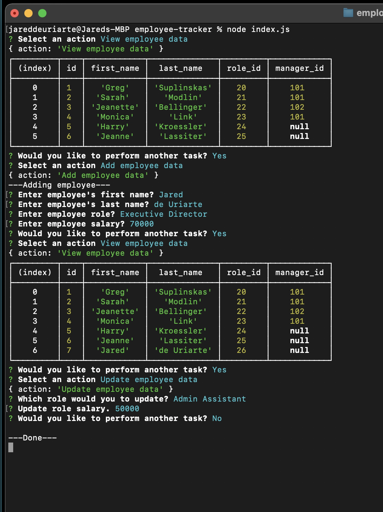

# Employee Tracker!
## Description
For the shrewd boss who must keep track of their staff most efficiently, I give you Employee Tracker!🤩 A simple command line application to easily view, add, and update employee data.

## Table of Contents
- [Description](#Description)
- [Deployment](#Deployment)
- [Usage](#Usage)
- [Features](#Features)
- [Credits](#Credits)
- [Contributing](#Contributing)
- [License](#License)
  

## Deployment
- [GitHub Repo](https://github.com/jareddeuriarte/employee-tracker)
  

  
### Usage
- Clone this repo
- In your terminal, change directories into the employee-tracker
- Initialize the command with `node index.js`

### Features
- Inquirer prompt entry
- Node.js techonology
- MySql technology
 

### Credits  
My tutor Namita.

### Contributing
Forks are welcome!

### License 
This project is licensed under MIT.

### Badges

  
### Questions?
Reach me at:
- [GitHub](https://github.com/jareddeuriarte)
- deuriartejared@gmail.com